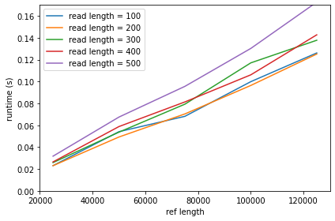
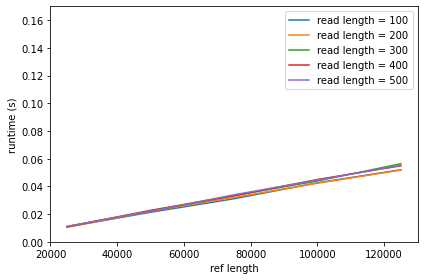
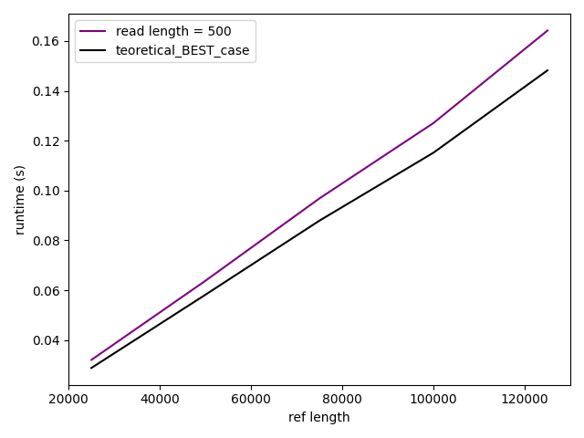
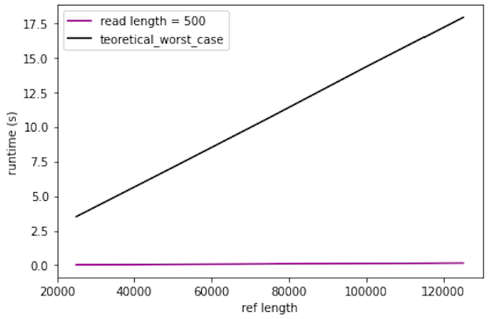

[](https://classroom.github.com/online_ide?assignment_repo_id=8392808&assignment_repo_type=AssignmentRepo)
# Basic exact pattern matching

This project is about exact pattern matching. You should implement the naive quadratic time algorithm and a linear time algorithm of your cheice, e.g. the border-array or the KMP-algorithm. The naive algorithm has the worst-case running time O(nm) and the other algorithms we have seen have worst-case running time O(n+m).

The algorithms should be implemented in two programs, `naive` and `lin`. Both programs should take two arguments (no more and no less): the first should be a Simple-FASTA file and the second a Simple-FASTQ file. The programs should output all matches in the Simple-SAM format to stdout (i.e., they should write to the terminal). Since we are only doing exact matching, the CIGAR strings in the output should consist of M’s only, since all the characters in the read will match the reference at the reported position.

For example, with this Simple-FASTA file

```
> chr1
mississippi
> chr2
mississippimississippi
```

and this Simple-FASTQ file

```
@read1
iss
@read2
mis
@read3
ssi
@read4
ssippi
```

your output should be

```
read1	chr1	2	3M	iss
read1	chr1	5	3M	iss
read1	chr2	2	3M	iss
read1	chr2	5	3M	iss
read1	chr2	13	3M	iss
read1	chr2	16	3M	iss
read2	chr1	1	3M	mis
read2	chr2	1	3M	mis
read2	chr2	12	3M	mis
read3	chr1	3	3M	ssi
read3	chr1	6	3M	ssi
read3	chr2	3	3M	ssi
read3	chr2	6	3M	ssi
read3	chr2	14	3M	ssi
read3	chr2	17	3M	ssi
read4	chr1	6	6M	ssippi
read4	chr2	6	6M	ssippi
read4	chr2	17	6M	ssippi
```

assuming you iterate over reads in an outer loop and FASTA records in an inner loop. If you order your loops differently, of course, the output will be different.

The project should be in groups of 2–3 students. It will not be graded.

## Part 1: parsers 

Write parsers for Simple-FASTA and Simple-FASTQ if you have not done so already.

ANSWER:
Both parsers are part of the lin.py and naive.py scripts (read_fasta(); read_fastq())

## Part 2: simulating data for evaluation

For testing the running time as functions of n and m, you should also write code for generating Simple-FASTA and Simple-FASTQ files (with appropriate properties for your tests).

ANSWER:
See src/SEQsimulator.py (was used for implementation of the algorithm).
(Note: fasta and fastq generators (provided by teacher) were used for final test set generation (See data_for_testing/simulate_simple_fasta.py; data_for_testing/simulate_simple_fastq.py))

## Part 2: mappers

Now write the tools for exact pattern matching. You can use the naive algorithm to test your linear time algorithm; the result of the two programs that you write should be identical after you sort the output.

```sh
> ./naive fasta.fa fastq.fq | sort > naive.sam
> ./lin fasta.fa fastq.fq | sort > lin.sam
> diff naive.sam lin.sam
```

ANSWER:
See src/naive.py (naive_algorithm()) and src/lin.py (ba_algorithm())

## Evaluation

Implement the two algorithms in two tools, `naive` and `lin`, that must be present at the root of the repository once they are built. The test setup checks that they give the correct output on selected data, but you should still carefully test them.

Once you have implemented the tools, fill out the report below. 

ANSWER:
See src/naive.py and src/lin.py

## Report

### Insights you may have had while implementing and comparing the algorithms. 

ANSWER:
Finally understood how border-arrays enables efficient/linear string-searching.

### Problems encountered if any. 

ANSWER:
I had some trouble jumping backwards (or rather figuring out that i had to repetitively jump back until i reached match) in my border-array (kind of a brain-fart i know) (finally fixed it with a while-loop). 

### Experiments that verifies the correctness of your implementations.

ANSWER:
I simulate a bunch of random DNA sequences of varying lengths (50-100 nucleotides; representing ref seqs), and from these sequence sampled random intervals of length 1-20 representing exact-read seqs. These samples were then used to test if my implentations returned the exact intervals/positions (compared to re.findall(), see first section of src/runtime_comparison.py) through 500000 iterations. 
Hereafter i similarily sampled ref/reads while feeding these to both algorithms (naive vs lin) simultaneously. The algorithms returned the same result for all iterations (500000; see src/runtime_comparison.py). A coverage test was performed using coverage.py (https://coverage.readthedocs.io/en/6.4.4/). For this purpuse a fasta file containing 5 sequences and a corresponding simple fastq file containing 100 reads were generated (using scripts provided by teacher in previus week, see data_for_testing/simulate_simple_fasta.py; data_for_testing/simulate_simple_fastq.py). The naive and lin algorithms had respectivly 95% and 94% coverage where all missing lines (naive: 15, 17, 21, 23; lin: 16, 32, 42, 44, 48, 50) was involved in early returnings as response to empty/incompatable inputs. These responses were then tested manually i.e. both algorithms were tested for varius empty input cases (empty/empty and non-empty/empty etc.) Sequences containing first and last 10 nucleotides repeatedly was used to test 'takeoff and landing'. 


### Experiments validating the running time.

For this section, you should address the following:

ANSWER:

Runtimes for varying lengths of m and n for the naive algorithm:


Runtimes for varying lengths of m and n for the linear algorithm:



* An experiment that verifies that your implementation of `naive` uses no more time than O(nm) to find all occurrences of a given pattern in a text. Remember to explain your choice of test data. What are “best” and “worst” case inputs? 

ANSWER:
Worst case for the naive is when n and m are all repetitions of the same character e.g. n = 'AAAAAAAAAAAAA' m = 'AAA'. In this case the algorithm will have to compare all characters from both strings against each other (runtime = mn). Oppositly if n and m are all different e.g. n = 'AAAAAAAAAAAAA' m = 'TTT' the algorithm will only have to compare the first character of m against all n (runtime = n). 

Runtimes naive best-case:


Runtimes naive worst-case:


* An experiment that verifies that your implementations of `lin` use no more time than O(n+m) to find all occurrences of a given pattern in a text. Remember to explain your choice of test data. What are “best” and “worst” case inputs?

ANSWER:
Best/worst cases are harder to compute for the linear (KMP) algorithm.

Best case is a situation where we always move the total length of m (runtime = n + n/m).

Worst case is a situation with as many character comparings (matches + mismatches) as possible (between m and n) and will happen in a situation like n = 'AAAABAAAABAAAABAAAAB' m = 'AAAAA'. Here we will move up the border which will afterwards point us to a series of wrong position (runtime = m+n).


